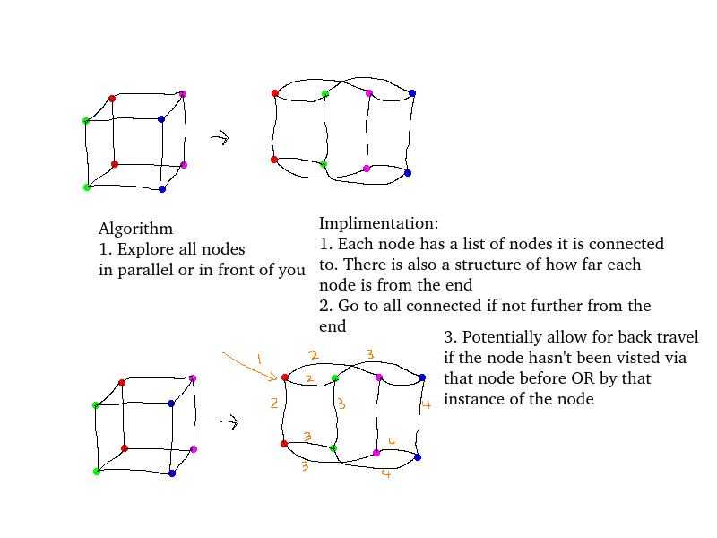
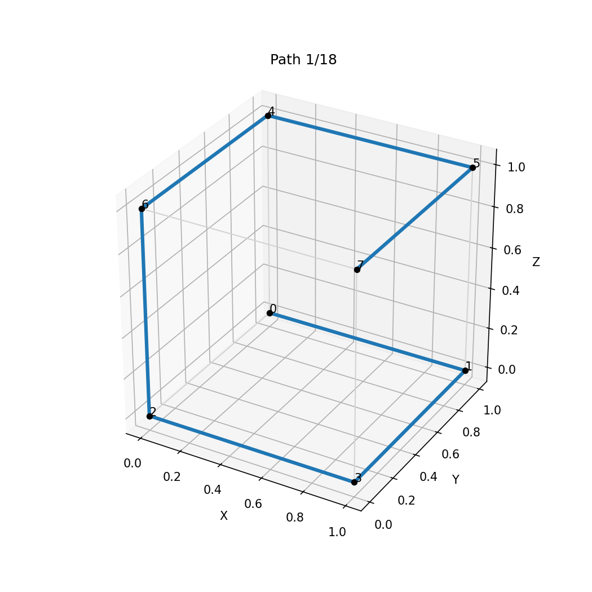
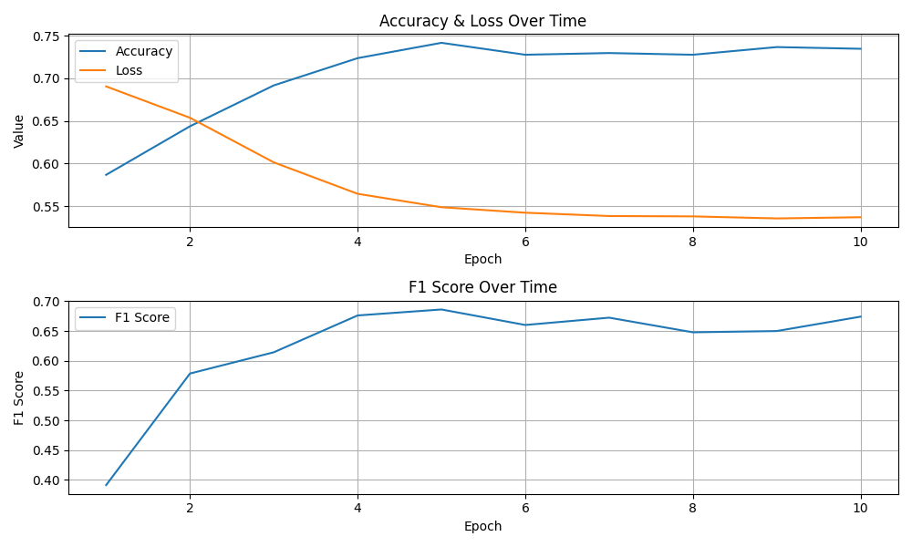
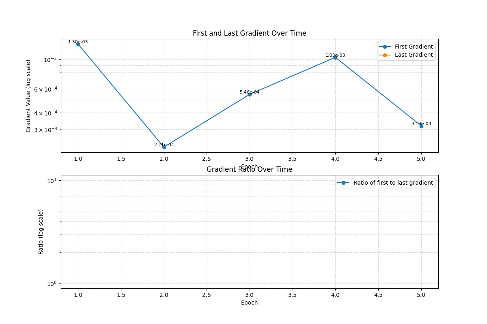

# 3D-Spatially-Biased-NN
A modification to PyTorch that allows for higher dimensional modelling and spatially biased connections between these higher dimension layers. 
See the [Notes Markdown](NOTES.md) for more details on how its going so far.

## Overall Plan
1. Create a basic template to modify and use
2. Choose a good basic dataset with which to use as a benchmark
3. Train the basic template (BT) on the data, then test and get benchmarks 
4. Create 3D modification, test, get benchmark 
5. Create spatially biased (SB) modification, get benchmark 
6. Combine 3D and SB, get benchmark
7. Compare original and 3D+SB metrics


## The basic template
The basic template is a way to get a baseline measurement. It is a simple deep NN. 

The training data used is heart disease data. The output of the model is 1 or 0, 1 meaning the person is at risk. 

The model is purposly not optimised very much so that the perfomance gains or pitfalls of the new models will be particually obvious

Initial Result:
```
Epoch 10 training loss: 0.5111
Top positive probs in this epoch: [0.9880862  0.98890173 0.99113715 0.99393445 0.9950433 ]
True positives: 158 / 440
Test Accuracy: 0.6856, F1-score: 0.5008
Confusion Matrix:
[[529  33]
 [282 158]]
```

 After adding seperation penalty:
 ```
Epoch 10 training loss: 2.8024
Top positive probs in this epoch: [0.9999883  0.99999154 0.9999926  0.9999931  0.99999523]
True positives: 322 / 440
Test Accuracy: 0.7246, F1-score: 0.7000
Confusion Matrix:
[[404 158]
 [118 322]]
 ```

Finally, lowered the pentlty and increased learning rate:
```
Epoch 10 training loss: 2.6683
Top positive probs in this epoch: [0.99999905 0.99999905 0.9999994  0.9999995  0.99999964]
True positives: 312 / 440
Test Accuracy: 0.7176, F1-score: 0.6880
Confusion Matrix:
[[407 155]
 [128 312]]
 ```

 Key training values:
 1. 10 epochs
 2. Learning rate = 0.002
 3. 17 input features
 4. 2 output classes
 5. 1043 nodes
 6. 271872 connections

 Here is the model architecture:
 ```python
 class Model(nn.Module):
    def __init__(self, input_length, num_classes):
        super(Model, self).__init__()
        self.linear_relu_stack = nn.Sequential(
            nn.Linear(input_length, 512),
            nn.ReLU(),
            nn.Linear(512, 512),
            nn.ReLU(),
            nn.Linear(512, num_classes),
        )
        
    def forward(self, x):
        logits = self.linear_relu_stack(x)
        return logits
```

## General Idea of 3D graphs
The below shows my intial ideas for the 3D graph as well as the algoithm used to traverse it.



From this, there are two 3D implimentations I plan to try:
1. The implimentation where I have one input node in each 3d Shape making a super node (the 3d shape) with each node within the shape being a sub node. This will be the "Super/Sub Implimentation (SSI)"
2. The implimentation where I have treat the shape (or multiple chained together) as the entire layer (e.g. the same input goes to the red and green nodes in the above picture) will be called the "Traditional Implimentation (TI)"

# Super Sub Implimentation

## Proof of concept
The initial proof of concept algorithm is shown in [ssi_algo_demo.py](ssi_algo_demo.py).

This uses a backtrack DFS algorithm to collect all paths from the chosen graph. These can then be filtered. 

Below is a gif on the paths the algorithm generated for the graph I made, which is currently a cube. 



## Basic Implimentation - First Attempt
The basic implimentation of this idea is stored in [customnn_module.py](SuberSub_Implimentation/custom_nn_module.py).

This creates 4 custom nn.Modules. 

1. ```EdgesModule``` defines edges as linear neurons.
2. ```GraphModule```  defines model where input goes into graph, is calculated along several paths, normalised, and outputed. It contains the ssi_algo_demo implimentation
3. ```GraphLayer``` stacks Graphs vertically, they all get the same input
4. ```SuperLayer``` connects together multiple graphLayers

The output from the first attempt of this model with 10 epochs was:

```
Epoch 10 training loss: 0.5371
Top positive probs in this epoch: [0.9467758  0.9468682  0.9503929  0.9530409  0.95535356]
True positives: 275 / 440
Test Accuracy: 0.7345, F1-score: 0.6740
Confusion Matrix:
[[461 101]
 [165 275]]
```



Just to confirm the model was accurately learning, I increased the lr from 0.00075 to 0.0005. I changed epochs from 10 t 50. 

This resulted in the same results as the above picture, with accuracy hanging around 0.73 and F1 Score around 0.68. 

To try and diagnose the issue, I made the parameters much simpler. The parameters were:

```python
dim = 1
width = 4
depth = 3
```

The graph of the first, last, and ratio of gradient is shown in the picture below, with the corresponding values from the first epoch (recorded each 100 values) are shown below that. 



```python
First Grads: [0.0012952653924003243, 0.00022093663574196398, 0.0005459666717797518, 0.0010310980724170804, 0.0003186153480783105]
Last Grads: [0.0, 0.0, 0.0, 0.0, 0.0]
Ratio List: [0, 0, 0, 0, 0]
```

From this it's clear that the issue is that the gradient quickly goes to 0 and this means the model can't make any further progress. 

Actions I took to try fix this include:
1. In the GraphModule, make the forward pass output square before returning. This aims to increase values and make them all positive. This did help increase gradients, but lowered model accuracy as negative connections couldn't exist so I removed this. 
2. In EdgeModule, I switched from RELU to Leaky RELU. This fixed the vanishing gradients, but the model was still stuck at 0.73 accuracy. The graphs of gradients and training metrics are [here (grads)](Pictures/gradient_3.png) and [here (training)](Pictures/training_metrics_2.png).
3. I then increased dimension to 64, leaving everything else as is, including leaky relu. This helped speed up model convergance, but it still got stuck at 0.73. 
4. I changed in GraphModule the exit node instead of averaging before normalisation, a learnable parameter was applied before normalisation. 

None of these seemed to have a major impact on test data accuracy. 

I then tried a Random forrest classified to see if the data could partially be the problem. The code is below:
```python
from sklearn.ensemble import RandomForestClassifier

rf = RandomForestClassifier(n_estimators=100, random_state=42)
rf.fit(xTrain, yTrain)
print(f"Random Forest accuracy: {rf.score(xTest, yTest):.4f}")
```

The output of this was:
```
Random Forest accuracy: 0.7295
```

To confirm these results, I then ran a linear regression. The output was:
```
Training Accuracy: 0.7407
Test Accuracy: 0.7405
Training R²: -0.0544
Test R²: -0.0535
McFadden's Pseudo R²: 0.2218
F1 Score: 0.6837
```

This indicates that the limiting factor was not either the baseline or the SSI model, but instead the data collected! I will run this again with a differnt dataset AFTER reading the kaggle comments to make sure it's appropriate :) 

## Basic Implimentation - Second Attempt
For this attempt, I keep everthing the same except I use a new dataset. 
The basic implimentation of this idea is stored in [customnn_module.py](SuberSub_Implimentation/custom_nn_module.py).

This creates 4 custom nn.Modules. 

1. ```EdgesModule``` defines edges as linear neurons.
2. ```GraphModule```  defines model where input goes into graph, is calculated along several paths, normalised, and outputed. It contains the ssi_algo_demo implimentation
3. ```GraphLayer``` stacks Graphs vertically, they all get the same input
4. ```SuperLayer``` connects together multiple graphLayers
